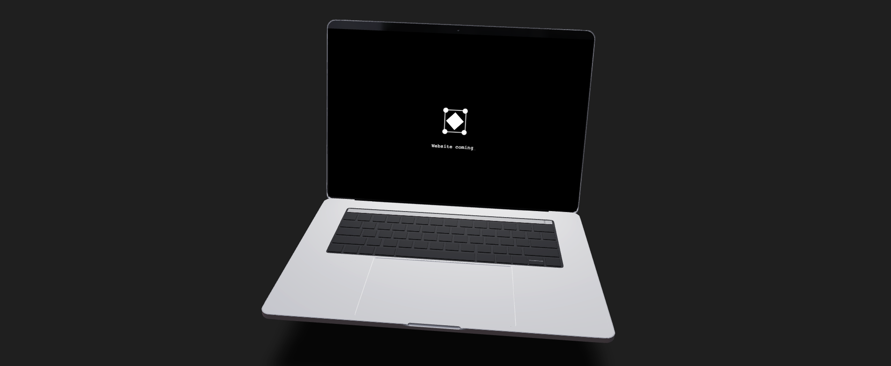
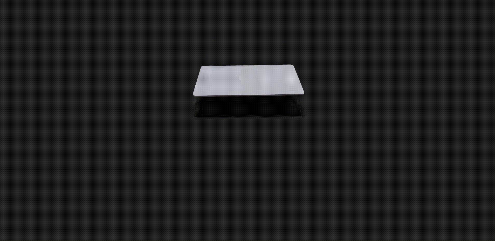

# 3D Animation of a mac - THREEJS and GSAP

This is a animation made with React Three Fiber and GSAP to animate a 3D model of a mac.
See [DEMO](https://qodall-mac.vercel.app/)



## How install and run



For install this project in your computer you need to clone this repository.  
Use the package manager [npm](https://www.npmjs.com/) to install all dependencies.

```bash
npm i
npm run dev
#or 
yarn install
yarn dev
#or 
pnpm i
pnpm dev
```

⚠️ For use this project you need to have a [GSAP](https://greensock.com/gsap/) licence.